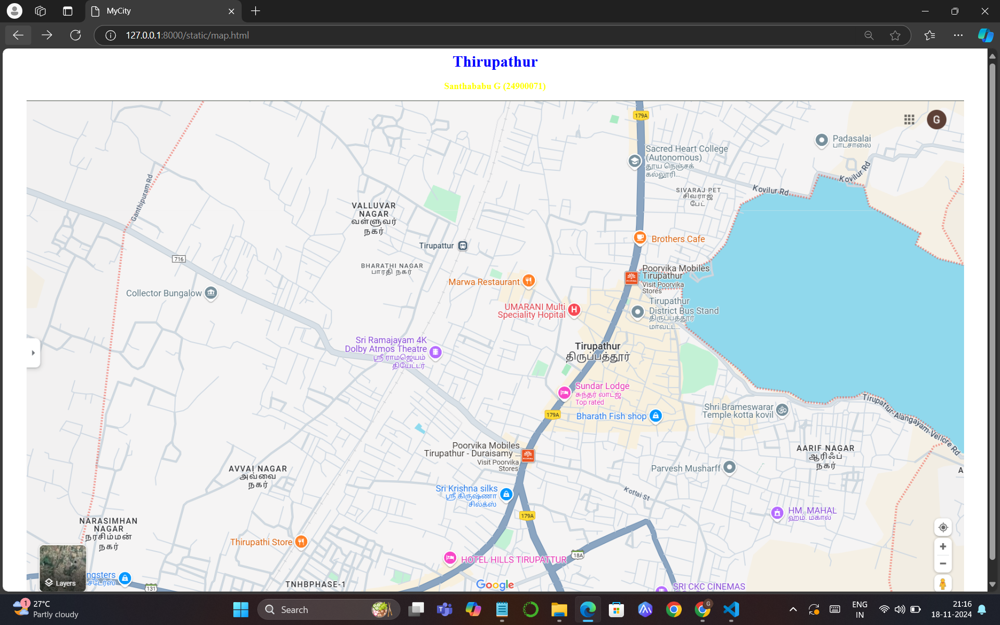
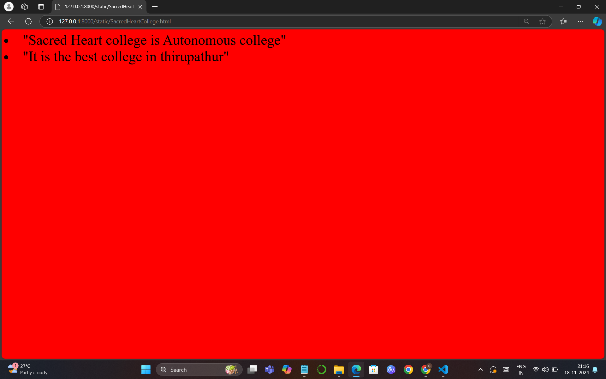
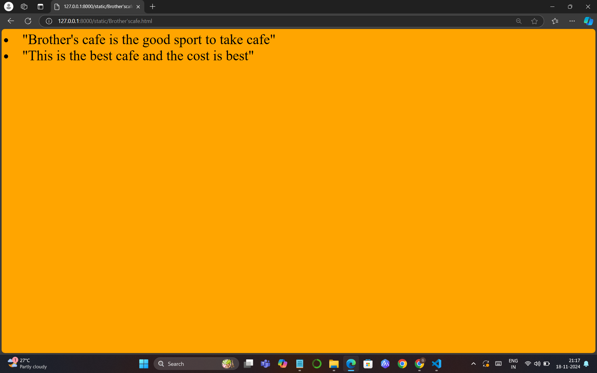
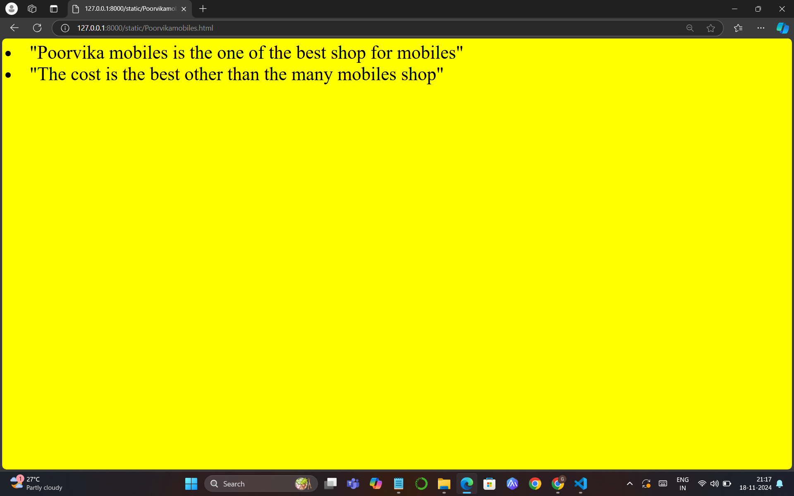
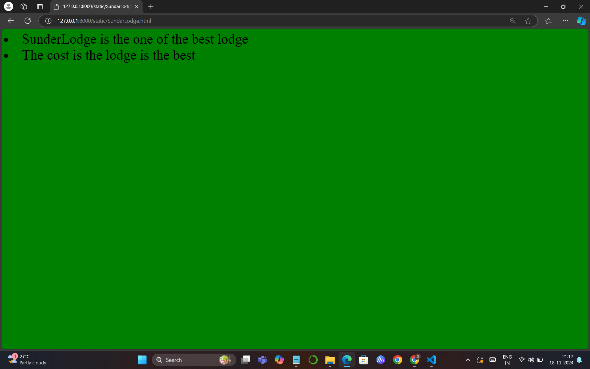
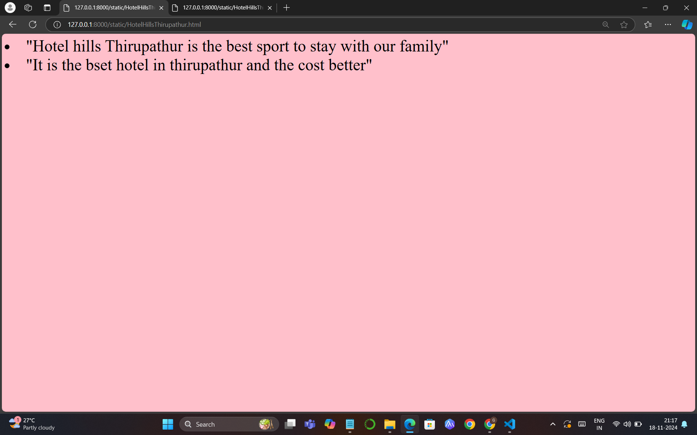
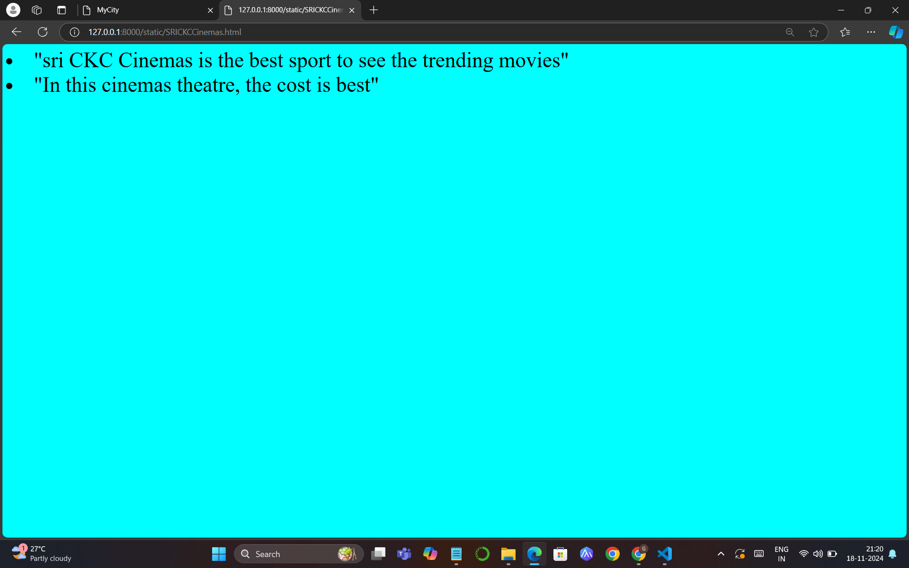

# Ex04 Places Around Me
## Date:18-11-2024 

## AIM
To develop a website to display details about the places around my house.

## DESIGN STEPS

### STEP 1
Create a Django admin interface.

### STEP 2
Download your city map from Google.

### STEP 3
Using ```<map>``` tag name the map.

### STEP 4
Create clickable regions in the image using ```<area>``` tag.

### STEP 5
Write HTML programs for all the regions identified.

### STEP 6
Execute the programs and publish them.

## CODE
```

map.html


<html>
<head>
<title>MyCity</title>
</head>
<body>
   <h1 align="center">
     <font color="blue"><b>Thirupathur</b></font>
</h1>
<h3 align="center">
<font color="Yellow">Santhababu G (24900071)</font>
</h3>
<center>


<map name="MyCity">
    <area  title="Sacred Heart College" href="SacredHeartCollege.html" coords="1257,85,1454,153" shape="rect">
    <area  title="Poorvika mobiles" href="Poorvikamobiles.html" coords="1247,332,1410,371" shape="rect">
    <area  title="Sundar Lodge" href="SundarLodge.html" coords="1094,575,1247,629" shape="rect">
    <area  title="Brother's cafe" href="Brother'scafe.html" coords="1254,253,1403,302" shape="rect">
    <area title="SRI CKC Cinemas" href="SRICKCCinemas.html" coords="1294,985,1486,1026" shape="rect">
    <area  title="Hotel Hills Thirupathur" href="HotelHillsThirupathur.html" coords="854,910,1132,964" shape="rect">
</map>
</center>
</body>
</html>


ScaredHeartCollege.html


<html>
  <body bgcolor="red">
    <font size="100">
   <li>"Sacred Heart college is Autonomous college"</li>
<li>"It is the best college in thirupathur"</li>
</font>
  </body>
</html>


Brother'scafe.html


<html>
<body bgcolor="orange">
    <font size="100">
<li>"Brother's cafe is the good sport to take cafe"</li>
<li>"This is the best cafe and the cost is best"</li>
</font>
</body>
</html>


Poorvikamobiles.html


<html>
<body bgcolor="yellow">
    <font size="100">
 <li>"Poorvika mobiles is the one of the best shop for mobiles"</li>
<li>"The cost is the best other than the many mobiles shop"</li>
</font>
</body>
</html>

SundarLodge.html


<html>
<body bgcolor="green">
    <font size="100">
<li>SunderLodge is the one of the best lodge</li>
<li>The cost is the lodge is the best</li>
</font>
</body>
</html>

HotelHillsThirupathur.html


<html>
<body bgcolor="pink">
    <font size="100">
<li>"Hotel hills Thirupathur is the best sport to stay with our family"</li>
<li>"It is the bset hotel in thirupathur and the cost better"</li>
</font> 
</body>
</html>

SRICKCCinemas.html


<html>
<body bgcolor="cyan">
    <font size="100">
<li>"sri CKC Cinemas is the best sport to see the trending movies"</li>
<li>"In this cinemas theatre, the cost is best"</li>
</font>
</body>
</html>

```
## OUTPUT









## RESULT
The program for implementing image maps using HTML is executed successfully.
